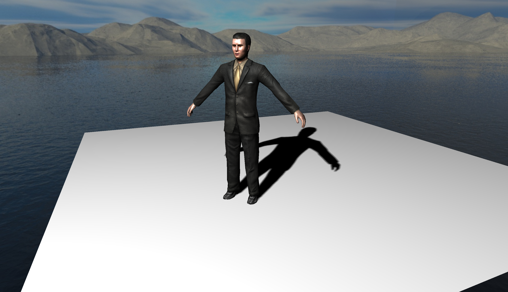
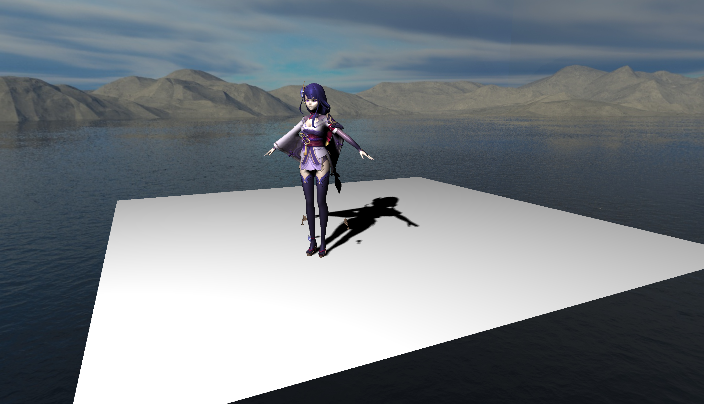
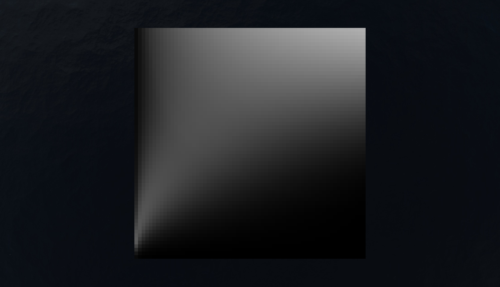
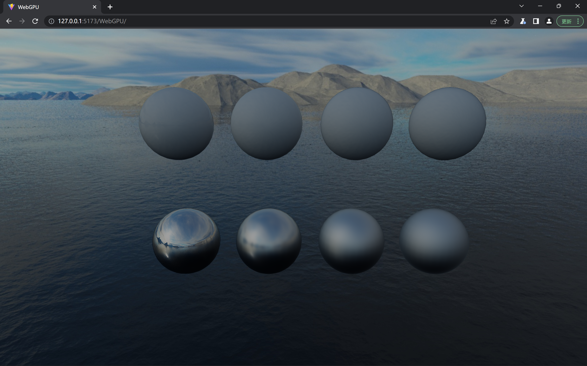
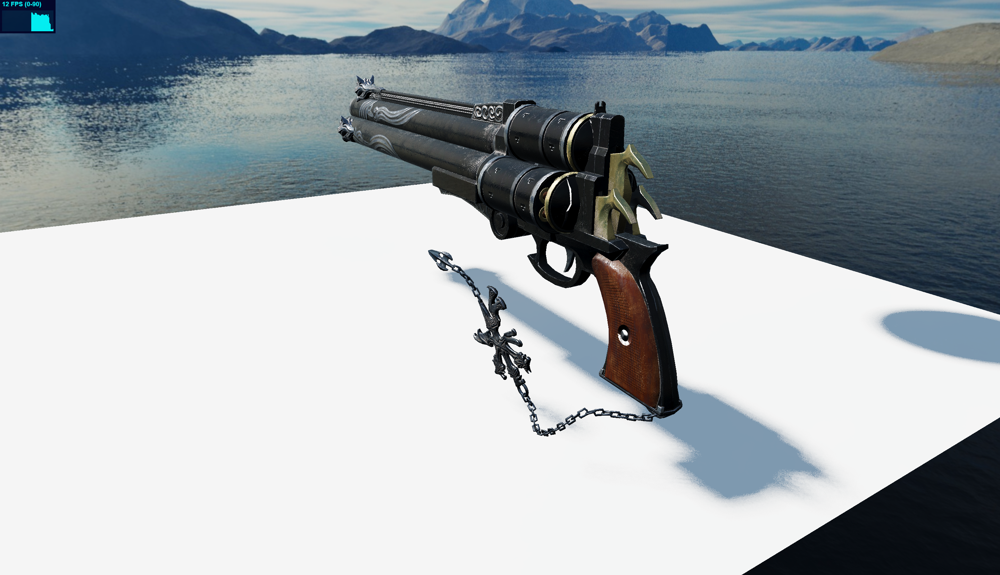

# Learning WebGPU

Implement a rendering framework with WebGPU API.

To do:

- [x] build framework
- [x] Blinn-Phong Shading
- [x] PCF shadow
- [ ] PCSS shadow
- [ ] TAA
- [x] Normal Map
- [x] Skybox
- [x] Instanced Mesh
- [x] Physically Based Shading
- [x] ACES Tone Mapping
- [x] Image Based Lighting
- [ ] Cascaded Shadow Map
- [ ] SubSurface Scattering
- [ ] GPU LoD
- [x] Animation
- [ ] GPU Driven Rendering

## Rendering

Blinn-Phong + PCF shadow + skybox:

Normal map:

Raiden Shogun of Genshin Impact:

Instance:

kulla-conty precompute:

DFG Texture:

Image Based Lighting

Phsically Lighting:

