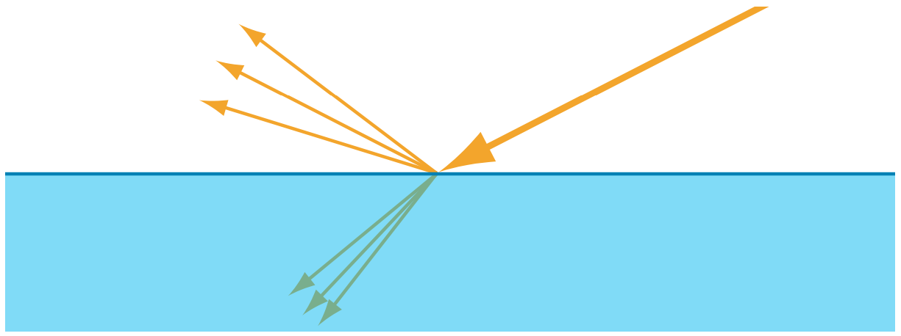
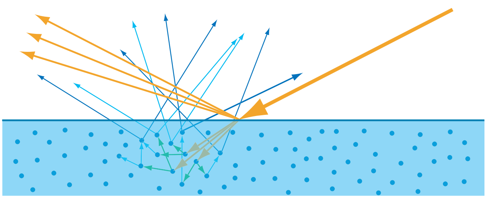
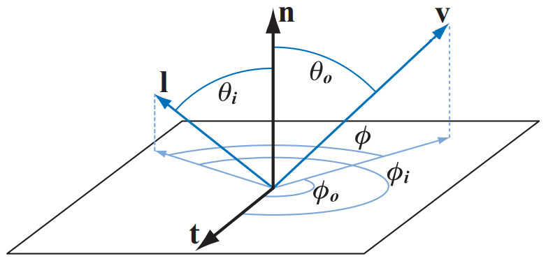
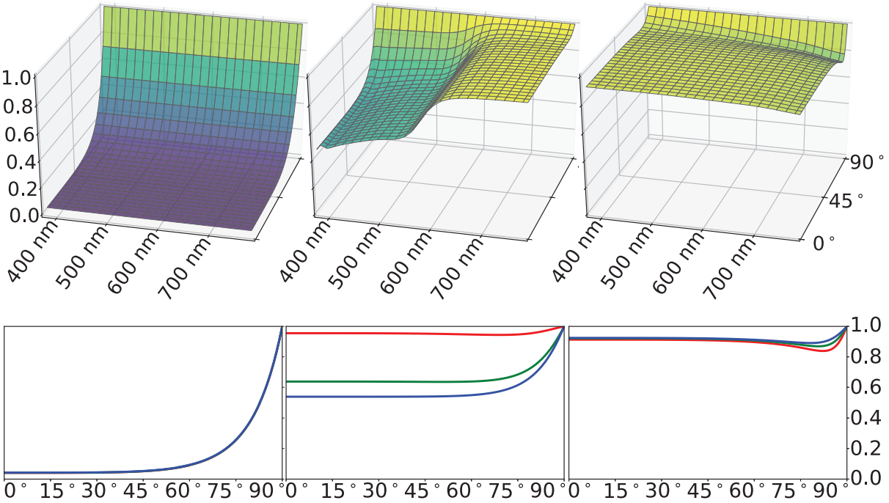
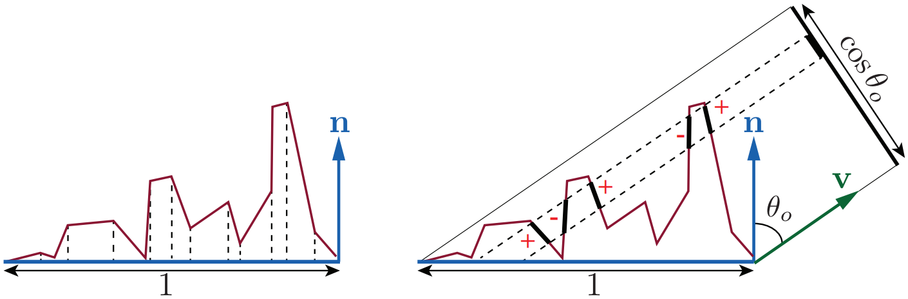
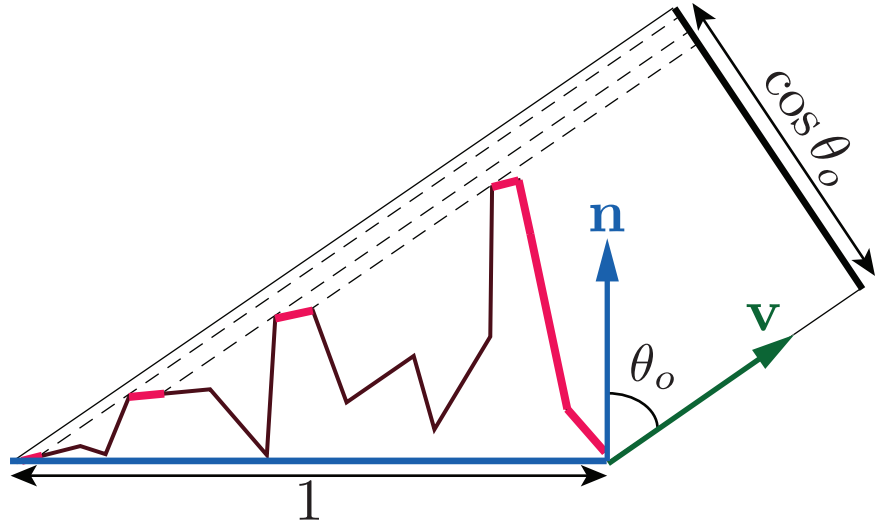
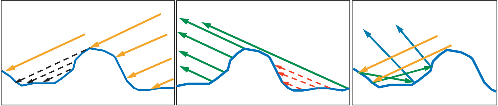
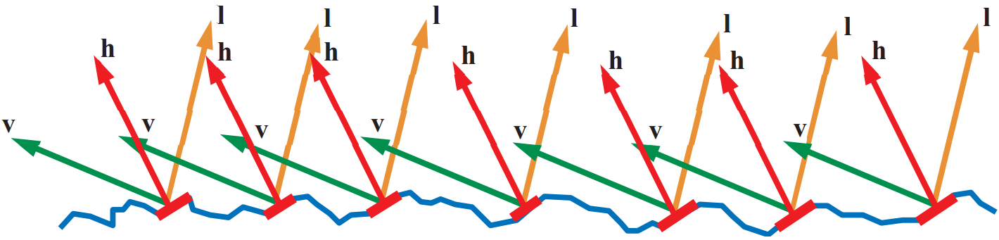
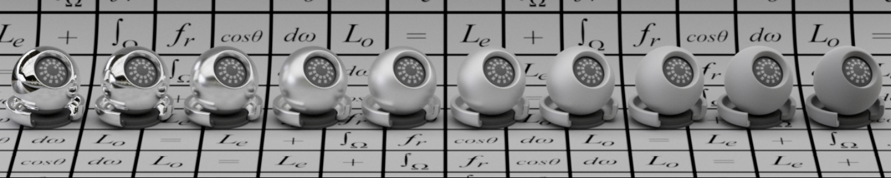
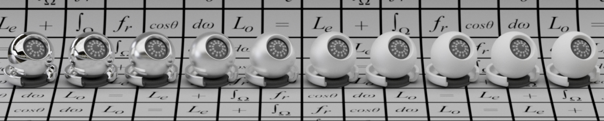

# Physically Based Shading


## 物理原理

### 光学现象

在物理世界中，光主要会与三种物质交互，他们产生的光学现象构成了人们眼中观察到的世界。

**粒子**（Particles）主要指气体，分子在其中的位置分布是随机且不相关的。当粒子为大气分子时，光在其中传播会发生**瑞利散射**（Rayleigh Scattering），而当粒子为固体时，发生的散射叫做**丁达尔散射**（Tyndall Scattering）。

**介质**（Media）主要匀质（Homogeneous Medium），光在其中传播会发生**吸收**和**散射**，吸收会决定介质的颜色，散射会决定介质的浑浊程度。

**表面**（Surfaces）即各种物体表面，光与其交互会发生**反射**和**折射**现象。而折射光进入介质中，又会进一步与介质进行交互。


<div style="font-family:仿宋;font-size:15px; text-align:center;">图1  入射光与表面交互图示。</div>

### 光与表面交互

光与非光学平坦表面（Non-Optically-Flat Surfaces）交互时，可以看成光与无数个微小的光学平坦表面交互的集合。物体越粗糙，微小平面越起伏，从而反射光也越模糊。在渲染中，模拟这个物理现象的模型称为微表面模型（Microfacet Theory）。



<div style="font-family:仿宋;font-size:15px; text-align:center;">图2  上图模型光滑，微表面起伏较小，反射清晰。下图模型粗糙，微表面起伏较大，反射模糊。</div>

以上理论描述了光与表面交互的反射现象，而折射现象与具体的物体类型有关。

在金属（导体，Conductor）中，折射光的能量会立即被自由电子吸收；在非金属（电介质，Dielectric）中，折射与光在介质中的现象相同，会发生散射和吸收。



<div style="font-family:仿宋;font-size:15px; text-align:center;">图3  入射光在表面发生折射与反射，折射光在介质内部经过散射与吸收后从表面重新出射。</div>

折射光与物体内部介质交互，经过散射和吸收后，重新从表面出射的现象，称为次表面散射（Subsurface Scattering）。漫反射（Diffuse）和次表面散射在微观本质上指的是同一种物理现象。但从宏观上，当次表面散射的出射光位置与入射光位置的距离差相对于像素大小可以忽略时，一般称之为漫反射，或局部次表面散射（Local Subsurface Scattering），反之称之为全局次表面散射（Global Subsurface Scattering）。

本文不考虑光线透射和全局次表面散射，总的来说，我们可以把着色拆分成衡量微表面散射的**高光项**（Specular term）和衡量局部次表面散射的**漫反射项**（Diffuse Term）。


## 基于物理的渲染理论

### 渲染方程

Kajiya给出完整的渲染方程（Rendering Equation）如下：
$$
L_o(\textbf p, \textbf v) = 
L_e(\textbf p, \textbf v) +
\int_{\textbf l \in \Omega} f(\textbf l, \textbf v) L_i(\textbf p, \textbf l)(\textbf n \cdot \textbf l)^+ \, \mathrm d \textbf l
$$
等式左边为表面位置 $$\textbf p$$ 在观察方向 $$\textbf v$$ 的辐亮度（Radiance，单位面积单位立体角的辐射通量） 。等式右边第一项为 $$\textbf p$$ 点自发光的辐亮度贡献，第二项为各个方向 $$\textbf l$$ 光照在表面进行反射散射等作用带来的辐亮度贡献，$$\Omega$$ 为需要积分的半球面。

#### BRDF

如果我们不考虑自发光，就可以将渲染方程简化为反射率方程（Reflectance Equation）：
$$
L_o(\textbf p, \textbf v) = 
\int_{\textbf l \in \Omega} f(\textbf l, \textbf v) L_i(\textbf p, \textbf l)(\textbf n \cdot \textbf l)^+ \, \mathrm d \textbf l
$$
方程中 $$L_i(\textbf p, \textbf l)$$ 为 $$\textbf l$$ 方向入射光辐亮度，$$(\textbf n \cdot \textbf l)^+$$ 为入射方向 $$\textbf l$$ 与表面法向 $$\textbf n$$ 夹角余弦值，它描述了入射角带来的表面接收到的辐照度（Irradiance，单位面积接收到的辐射通量）衰减。可以类比于太阳光直射赤道时，维度越高，地球上单位面积接收到的辐射通量越少。

方程中 $$f(\textbf l, \textbf v)$$ 定义为**出射辐亮度与入射辐照度的比值**，衡量了物体表面对光线的作用，描述了物体的材质。它叫作**双向反射分布函数**（Bidirectional Reflectance Distribution Function, BRDF）。
$$
f(\textbf l, \textbf v) = \frac {\mathrm d L_o(\textbf v)} {\mathrm d E_i(\textbf l)}  \qquad
\mathrm d E_i = L_i(\textbf l) (\textbf n \cdot \textbf l)^+ \mathrm d \textbf l
$$
在以 $$\textbf p$$ 点为原点的局部坐标系下，$$\textbf l$$ 与 $$\textbf v$$ 分别需要两个参数决定：与法向 $$\textbf n$$ 的夹角 $$\theta$$，与切线 $$\textbf t$$ 的夹角 $$\phi$$。



<div style="font-family:仿宋;font-size:15px; text-align:center;">图4  局部坐标系下的入射方向与观察方向。</div>

对立体角 $$\textbf l$$ 的半球积分可以具体写成：
$$
\int_{\textbf l \in \Omega} \;\mathrm d \textbf l = 
\int_{\phi=0}^{2\pi} \int_{\theta=0}^{\frac{\pi}{2}} 
\sin \theta \,\mathrm d \theta \,\mathrm d \phi
$$
记 $$\mu_i = \cos \theta_i$$ 与 $$ \mu_o = \cos \theta_o$$，公式x可以写作：
$$
L_o(\mu_o, \phi_o) =
\int_{\phi_i=0}^{2\pi} \int_{\mu_i=0}^{1}
f(\mu_i,\phi_i,\mu_o,\phi_o) L(\mu_i,\phi_i)\mu_i 
\,\mathrm d \mu_i \,\mathrm d \phi_i
$$
显然其中的BRDF方程有4个参数，而如果物体材质是各向同性的，那么BRDF与方位角 $$\phi_i$$ ， $$\phi_o$$ 的绝对大小是无关的，仅与它们的相对大小有关，即方位角之差 $$\phi$$。所以各向同性的BRDF仅3个参数，这也是绝大多数物体的属性。

BRDF并不是一个随意的函数，物理规律使得它需要满足两条原则。

第一，赫尔姆霍兹互换原则（Helmholtz Reciprocity），即入射与出射方向互换后，函数值不变，数学公式如下：
$$
f(\textbf l, \textbf v) = f(\textbf v, \textbf l)
$$
第二，能量守恒原则（Conservation of Energy），即出射能量不能大于入射能量。这也是基于物理的着色模型与基于经验的着色模型的主要区别之一。定向半球反射率（Directional-Hemispherical Reflectance）反应了BRDF的能量损失，数学公式如下：
$$
R(\textbf l) = \int_{\textbf v \in \Omega} f(\textbf l, \textbf v) (\textbf n \cdot \textbf v) \,\mathrm d \textbf v
$$
它的含义是在方向 $$\textbf l$$ 入射辐照度为1时，BRDF在各个方向出射辐照度的积分。由于能量守恒，$$R(\textbf l)$$ 函数的值域为 $$[0,1]$$，$$R(\textbf l)=0$$ 表示入射光能量被全部吸收。

#### 漫反射项BRDF

在实时渲染中，常用的漫反射BRDF为Lambertian模型，它非常简单，但与其他复杂模型效果差别并不明显^[9]^，同时可以能够高效地应用于球谐光照^[12]^（Spherical Harmonic Lighting）或基于图像的光照（Image Based Lighting）等技术。它的公式如下：
$$
f_{diff}(\textbf l, \textbf v) = \frac{\rho_{ss}} {\pi}
$$
上式中，$$\rho_{ss}$$ 为表面反照率（Albedo），表示了表面对各个波长能量的吸收情况，存储为一个RGB值。上式推导如下：

Lambertian模型认为漫反射在各个方向的值是相同的，即 $$f_{diff}$$ 是一个常数。根据公式x，在没有任何能量损失的情况下 $$R(\textbf I) = 1$$，可以得到：
$$
\int_{\textbf v \in \Omega} f_{diff} \cdot(\textbf n \cdot \textbf v) \,\mathrm d \textbf v = f_{diff} \cdot\int_{\textbf v \in \Omega} (\textbf n \cdot \textbf v) \,\mathrm d \textbf v = 1 \\
其中
\int_{\textbf v \in \Omega} (\textbf n \cdot \textbf v) \,\mathrm d \textbf v =
\int_{\phi_o=0}^{2\pi} \int_{\theta_o=0}^{\frac{\pi}{2}} 
\sin \theta_o \cos \theta_o \,\mathrm d \theta_o \,\mathrm d \phi_o
= \pi
$$
所以 $$f_{diff} = \frac {1}{\pi}$$ ，考虑材质对入射光的吸收后，即可得到公式x。

### 菲涅尔效应

菲涅尔效应（Fresnel Effect）指的是，光线照射某种材质表面时被反射与折射的比例，随着入射角变化而变化。入射角越大，反射越明显。


<div style="font-family:仿宋;font-size:15px; text-align:center;">图5  菲涅尔效应。直接向下看水面时（垂直入射），被反射的比例小，所以可以直接看到水底；<br>而向远处看水面时（掠射），被反射的比例高，可以看到天空的倒影。</div>

菲涅尔函数 $$F(\theta_i)$$ 定义为入射光被反射的比例，当材质一定时，它仅于入射角有关。当 $$\theta_i=0^{\circ}$$ 时，方程反应了垂直入射光被反射的比例，它是材质的一个属性，记为 $$F_0$$；当 $$\theta_i=90^{\circ}$$ 时， 光线入射任何物质都被完全反射，即 $$F_{90}=1$$。

同一材质，对不同波长的入射光反射比例也是不同的，所以 $$F(\theta_i)$$ 是一个RGB的矢量函数。对于非金属，$$F(\theta_i)$$ 对波长的变化非常不明显，且 $$F_0$$ 值较小，通常在0.06以下；而对于金属，$$F(\theta_i)$$ 对波长的变化非常明显，且 $$F_0$$ 值往往在0.5以上。具体实现上，非金属 $$F_0$$ 通常保存为一个标量，金属 $$F_0$$ 则保存为一个RGB值。



<div style="font-family:仿宋;font-size:15px; text-align:center;">图6  三种材质在不同入射角对不同波长的菲涅尔值。<br>从左至右分别为玻璃、铜、铝。第一行为不同波长菲涅尔值，第二行为转换为RGB的菲涅尔值。</div>

对于菲涅尔函数，Schlick给出了近似：
$$
F(\textbf n, \textbf l) \approx F_0 + (F_{90} - F_0) (1 - (\textbf n \cdot \textbf l)^+)^5
$$
上式也可以写作：
$$
F_c = (1 - (\textbf n \cdot \textbf l)^+)^5 \\
F(\textbf n, \textbf l) \approx F_cF_{90} + (1-F_c)F_0
$$
这样可以将Schlick近似理解为用 $$F_c$$ 插值 $$F_0$$ 与 $$F_{90}$$，其中 $$F_{90}=1$$。

### 微表面理论

物体表面的微小起伏使得表面粗糙度不同，不过这种起伏远小于一个像素，所以物体模型不可能如此精细。而这些起伏会影响光在物体表面的反射，所以可以使用BRDF模型从统计学上模拟这些微小平面整体对光照着色的影响。微表面理论起源于光学界，由Blinn于1977年以及Cook和Torrance在1981年引入计算机图形学^[4][5]^。

#### 法向分布函数

在微观上，记每个微平面的法向为 $$\textbf m$$，且它们都遵循一个微观的BRDF $$f_{\mu}(\textbf l, \textbf v, \textbf m)$$ 来反射光线，一般将可以这个BRDF直接简化为理想的菲涅尔镜面反射。将所有微观BRDF加起来，就得到了宏观上整个表面的BRDF。



<div style="font-family:仿宋;font-size:15px; text-align:center;">图7  将微表面投影至宏观表面或其他平面。</div>

微表面模型BRDF的一个重要属性就是微平面的法向统计分布，我们使用法向分布函数（Normal Distribution Function, NDF）来衡量，记作 $$D(\textbf m)$$ ^[6]^。它的具体含义是：**单位宏观表面上，法向为 $$\textbf m$$ 的微平面面面积**。所以对 $$D(\textbf m)$$ 积分将得到微表面总面积，而对 $$D(\textbf m)(\textbf n \cdot \textbf m)$$ 积分将得到单位宏观表面片元的面积，即 $$D(\textbf m)$$ 需要满足：
$$
\int_{\textbf m \in \Theta} D(\textbf m)(\textbf n \cdot \textbf m) \,\mathrm d \textbf m = 1
$$
其中，$$\Theta$$ 表示对整个球面积分，$$\textbf n$$ 为宏观表面法向。$$D(\textbf m)(\textbf n \cdot \textbf m)$$ 表示微平面在在宏观表面上的投影的面积。

同时，将微表面和宏观表面都投影至与观察方向垂直的表面上，得到的面积是相等的，即：
$$
\int_{\textbf m \in \Theta} D(\textbf m)(\textbf v \cdot \textbf m) \,\mathrm d \textbf m = \textbf v \cdot \textbf n
$$

Walter等人^[8]^提出了GGX法向分布模型，这是应用最广泛的NDF，它的公式如下：
$$
\tag{1}
D(\textbf m) = \frac {\chi^+(\textbf m \cdot \textbf n) \alpha_g^2} {\pi (1 + (\textbf m \cdot \textbf n)^2 (\alpha_g^2 - 1))^2}
$$
其中 $$\chi^+(x)$$ 为正特征函数， $$\alpha_g$$ 是粗糙度系数，在迪士尼原则（Disney principled）的着色模型^[13]^中，用户可见的粗糙度参数为 $$r$$，而 $$\alpha_g= r^2$$。

#### 几何函数

##### 遮蔽函数

公式x中，$$(\textbf v \cdot \textbf m)$$ 有可能小于零，如图7所示，正是 $$(\textbf v \cdot \textbf m)$$ 项正负抵消，才得到了正确的结果。而如果我们只考虑从观察方向 $$\textbf v$$ 可见的微平面，就需要引入一个遮蔽函数（Masking Function），记为 $$G_1(\textbf m, \textbf v)$$。它描述了法向为 $$\textbf m$$ 的微表面中，从 $$\textbf v$$ 方向可见的比例。所以 $$G_1(\textbf m, \textbf v)D(\textbf m)$$ 就描述了可见的微表面法向分布。同时，公式x可以写为：
$$
\int_{\textbf m \in \Theta} G_1(\textbf m, \textbf v)D(\textbf m) (\textbf v \cdot \textbf m)^+ \,\mathrm d \textbf m = \textbf v \cdot \textbf n
$$


<div style="font-family:仿宋;font-size:15px; text-align:center;">图8  几何遮蔽函数作用示意图。</div>

NDF描述了不同朝向的微表面的统计分布，而遮蔽函数 $$G_1$$ 则隐含了这些不同朝向的微表面在空间上如何排列的信息。Smith遮蔽函数^[7]^适用于任意NDF。Heitz证明了它具有良好的性质^[6]^，一方面，它满足公式x，另一方面，它与微表面具体的法向 $$\textbf m$$ 是无关的。公式如下：
$$
\tag{1}
G_1(\textbf m, \textbf v) = \frac {\chi^+(\textbf m \cdot \textbf v)} {1 + \Lambda (\textbf v)}
$$
其中 $$\chi^+(x)$$ 为正特征函数。$$\Lambda$$ 函数需要从特定的NDF中推导，Walter等人^[8]^与Heitz^[6]^给出了方法。在微表面朝向和遮蔽情况无关（Normal-Masking Independence）的假设下，Smith G~1~是精确的，而当这点假设不成立时（比如布料纤维等材质），它的精确性就会下降。

GGX法线分布具有形状不变性（Shape-Invariant），可以推导出解析形式的 $$\Lambda$$ 函数。
$$
\tag{1}
\Lambda(\textbf s) = \frac {-1 + \sqrt {1 +  \frac {1} {a^2}}} {2} \qquad a= \frac {\textbf n \cdot \textbf s} {\alpha_g \sqrt{1 - (\textbf n \cdot \textbf s)^2}}
$$

##### 遮蔽阴影函数



<div style="font-family:仿宋;font-size:15px; text-align:center;">图9  阴影，遮蔽，多次弹射</div>

如图九所示，$$G_1$$ 函数仅考虑了从观察方向产生的微表面遮蔽情况，而关系在照射微表面时，会产生类似的现象，称之为阴影（Shadowing）。同时考虑两种遮挡的函数称之为遮蔽阴影函数（Masking-Shadowing Function），记作 $$G_2(\textbf l, \textbf v, \textbf m)$$。最简单的 $$G_2$$ 函数假设两种遮挡是无关的，称为分离形G~2~（Separable Form）公式如下：
$$
G_2(\textbf l, \textbf v, \textbf m) = G_1(\textbf m, \textbf v) G_1(\textbf m, \textbf l)
$$
这种假设与现实不符，会造成渲染结果过暗。加入高度相关的因素，从Smith G~1~中可以推导出Smith高度相关的遮挡阴影函数（Smith Height-Correlated Masking-Shadowing Function）：
$$
\tag{1}
G_2(\textbf l, \textbf v, \textbf m) =
\frac {\chi^+(\textbf m \cdot \textbf v) \chi^+(\textbf m \cdot \textbf l)}
{1 + \Lambda (\textbf v) + \Lambda (\textbf l)}
$$
Heitz还给出了一个结合方向相关（Direction-Correlated）与高度相关的Smith G~2~函数：
$$
G_2(\textbf l, \textbf v, \textbf m) =
\frac {\chi^+(\textbf m \cdot \textbf v) \chi^+(\textbf m \cdot \textbf l)}
{1 + \max(\Lambda (\textbf v), \Lambda (\textbf l)) + \lambda(\textbf v, \textbf l) \min(\Lambda (\textbf v), \Lambda (\textbf l))}
\\
\lambda(\phi) = 1 - e^{-7.3\phi^2}
$$
由于公式x复杂度与Smith G~1~相似，所以广泛应用于实践中^[9][10][11]^。

#### 高光项BRDF



<div style="font-family:仿宋;font-size:15px; text-align:center;">图12  半程向量</div>

从微表面理论中，可以推导得到**高光项BRDF**（Specular BRDF Term），称为Cook-Torrance BRDF^[5]^，公式如下：
$$
\tag{1}
f_{spec} = \frac {F(\textbf h, \textbf l)G_2(\textbf l, \textbf v, \textbf h)D(\textbf h)} 
{4 (\textbf n \cdot \textbf l)^+ (\textbf n \cdot \textbf v)^+}
$$
其中 $$\textbf h$$ 为半程向量。推导如下：

首先，只有 $$\textbf m = \textbf h$$ 的这些微平面才能将入射光反射至观察方向。根据NDF定义，可以得到这些微平面面积为 $$D(\textbf h) \,\mathrm d \textbf h \,\mathrm d A$$，再去除掉被遮挡的微平面，有效面积为 $$G_2(\textbf l, \textbf v, \textbf h)D(\textbf h) \,\mathrm d \textbf h \,\mathrm d A$$。另外根据公式x，这些微平面上的入射辐照度为 $$L_i(\textbf l) (\textbf h \cdot \textbf l)^+ \mathrm d \textbf l$$，所以入射辐射通量为：
$$
\mathrm d^3 \Phi_i = \mathrm d E_i \,\mathrm d^2 A_{\bot \textbf h} =
G_2(\textbf l, \textbf v, \textbf h)D(\textbf h)
L_i(\textbf l) (\textbf h \cdot \textbf l)^+
 \,\mathrm d \textbf l \,\mathrm d \textbf h \,\mathrm d A
$$
然后，我们将微观BRDF $$f_{\mu}(\textbf l, \textbf v, \textbf m)$$ 简化为简单的菲涅尔反射，损失的能量有菲涅尔函数决定，所以出射辐射通量为：
$$
\mathrm d^3 \Phi_o = F(\textbf h, \textbf l) \mathrm d^3 \Phi_i
$$
所以出射辐亮度为：
$$
\mathrm d L_o(\textbf v) = \frac {\mathrm d^3 \Phi_o} {\mathrm d \textbf v \mathrm d A_{\bot \textbf v}} =
\frac {
    F(\textbf h, \textbf l)G_2(\textbf l, \textbf v, \textbf h)D(\textbf h)
    L_i(\textbf l) (\textbf h \cdot \textbf l)^+
     \,\mathrm d \textbf l \,\mathrm d \textbf h \,\mathrm d A
 }
 {
 	(\textbf n \cdot \textbf v)^+ \mathrm d \textbf v \mathrm d A
 }
$$
根据公式x，BRDF为：
$$
f_{spec} = \frac {\mathrm d L_o(\textbf v)} {\mathrm d E_i(\textbf l)} =
\frac {\mathrm d L_o(\textbf v)} {L_i(\textbf l) (\textbf n \cdot \textbf l)^+ \mathrm d \textbf l} =
\frac 
 {F(\textbf h, \textbf l)G_2(\textbf l, \textbf v, \textbf h)D(\textbf h) (\textbf h \cdot \textbf l)^+}
 {(\textbf n \cdot \textbf l)^+ (\textbf n \cdot \textbf v)^+}
\cdot \frac {\mathrm d \textbf h} {\mathrm d \textbf v}
$$
最后，显然我们需要求得微分立体角 $$\mathrm d \textbf h$$ 与 $$\mathrm d \textbf v$$ 之间的比值。以 $$\textbf l$$ 方向为z轴建立坐标系，令 $$\textbf h$$ 与z轴的夹角为 $$\theta$$，方位角为 $$\phi$$，那么显然 $$\textbf v$$ 与z轴的夹角为 $$2\theta$$，方位角也为 $$\phi$$。所以：
$$
\frac {\mathrm d \textbf h} {\mathrm d \textbf v} = \frac {\sin \theta \,\mathrm d \theta \,\mathrm d \phi} {\sin 2\theta \,\mathrm d 2\theta \,\mathrm d \phi} = \frac {1} {4 \cos \theta} = \frac {1} {4(\textbf h \cdot \textbf l)^+}
$$
将上式代入公式x中，即可得到Cook-Torrance BRDF。

#### 多次弹射

从图九中可以看到，除了简单的遮挡，光线还会在微表面之间进行多次弹射后出射。而我们上问所讨论Cook-Torrance BRDF忽略了这一点，所以最终的渲染结果会偏暗，并且材质粗糙度越高，多次弹射现象越明显，能量损失也越严重。Kulla与Conty提出了多次弹射的BRDF项^[10]^，达到了能量补偿的效果。



<div style="font-family:仿宋;font-size:15px; text-align:center;">图10  多次弹射能量损失</div>



<div style="font-family:仿宋;font-size:15px; text-align:center;">图11  Kulla-Conty多次弹射能量补偿</div>

### 具体实现

#### 参数化

根据上文阐述，在渲染着色过程中，我们需要两类信息，一类是空间信息，比如法向，观察方向，光照方向等；另一类是材质信息，比如菲涅尔项中的 $$F_0$$，漫反射项中的反照率，微表面模型中的表面粗糙度等。空间信息一般可以从顶点着色器中插值得到，而材质信息则一般需要从附加的贴图资源中提供。所以需要将材质信息参数化为若干易于理解的字段，用于美术资产制作。

由于非金属材质的 $$F_0$$ 一般较小，可以取一个特定的值（如0.04），并且金属材质没有漫反射，不需要反照率参数，所以可以将非金属的反照率和金属的 $$F_0$$ 用一张贴图存储（基础颜色），同时再用一张贴图保存材质是否为金属（金属度）。

在高光项的微表面BRDF中，我们只需要一张粗糙度贴图，如前文所述，公式x中使用的粗糙度与暴露给用户的粗糙度之间存在映射关系 $$\alpha = r^2$$。

<div style="font-family:仿宋;font-size:15px; text-align:center;">表1  PBR材质参数化</div>

| 参数名    | 数据类型    | 取值范围     | 说明     |
| --------- | ----------- | ------------ | -------- |
| baseColor | vec3\<f32\> | [0 ... 1]^3^ | 基础颜色 |
| metalness | \<f32\>     | {0, 1}       | 金属度   |
| roughness | \<f32\>     | [0 ... 1]    | 粗糙度   |

参数映射代码：

```wgsl
// src/renderer/resource/shaderChunk.js

let alpha = material.roughness * material.roughness;
let F0 = lerp_vec3(vec3<f32>(0.04), material.baseColor, material.metalness);
let albedo = material.baseColor * (1.0 - material.metalness);
```

#### 菲涅尔项

菲涅尔项的实现采用了Schlick近似，即公式x。同时参考虚幻4引擎^[9]^，使用球面高斯（Spherical Gaussian）近似^[14]^计算公式中的五次方项，略微提高了性能（内置函数`exp2()`比`pow()`更快）。另外，$$F_0$$ 小于0.02的值是在物理上错误的，所以这种情况发生时，可以认为此处的着色片段需要去掉菲涅尔效应带来的掠射角反射增强效果，虚幻^[9]^和寒霜^[11]^引擎都使用了这样的参数化技巧。
$$
F(\textbf v, \textbf h) \approx F_0 + (1 - F_0) 2^{(-5.55473(\textbf v \cdot \textbf h) - 6.98316)(\textbf v \cdot \textbf h)}
$$
菲涅尔项实现代码：

```wgsl
// src/renderer/resource/shaderChunk.js

fn Fresnel_Schlick(F0: vec3<f32>, VoH: f32) -> vec3<f32> { // Fresnel reflectance (Schlick approximation)
  let Fc = exp2((-5.55473 * VoH - 6.98316) * VoH); // faster than pow()
  return saturate(50.0 * F0.g) * Fc + (1.0 - Fc) * F0; // Anything less than 2% is physically impossible 
}                                                      // and is instead considered to be shadowing
```

#### 法向分布与几何函数

根据基于微表面模型的高光项BRDF（公式x），我们可以把几何项 $$G$$ 与分母的校正因子合并为一个可见性项（Visibility Term），记作 $$V$$
$$
\tag{1}
f_{spec} = F(\textbf h, \textbf l)V(\textbf l, \textbf v, \textbf h)D(\textbf h) \qquad V(\textbf l, \textbf v, \textbf h) = \frac {G_2(\textbf l, \textbf v, \textbf h)} 
{4 (\textbf n \cdot \textbf l)^+ (\textbf n \cdot \textbf v)^+}
$$
如果法向分布函数选择应用广泛的GGX模型，几何函数选择Heiz推荐的Smith高度相关的遮挡阴影函数。Lagarde^[11]^发现这种情况下，$$V$$ 项中的分母可以和 $$G_2$$ 项相消，从而转化为：
$$
\tag{1}
V(\textbf l, \textbf v, \textbf h) = \frac {0.5} 
{\mu_o \sqrt {\alpha_g^2 + \mu_i(\mu_i - \alpha_g^2\mu_i)} + \mu_1 \sqrt {\alpha_g^2 + \mu_o(\mu_o - \alpha_g^2\mu_o)}} \\
其中 \; \mu_i = (\textbf n \cdot \textbf l)^+ \quad \mu_o = (\textbf n \cdot \textbf v)^+
$$
证明如下：

结合公式x与公式x，可以得到GGX模型的高度相关Smith阴影遮挡函数的具体形式为：
$$
\begin{aligned}
G_2(\textbf l, \textbf v, \textbf h) &=
\frac {\chi^+(\textbf h \cdot \textbf v) \chi^+(\textbf h \cdot \textbf l)}
{1 + \Lambda (\textbf v) + \Lambda (\textbf l)} \\
&= \frac {1} {1 + \Lambda (\textbf v) + \Lambda (\textbf l)} \\
&= \frac {2} { \sqrt{1 + \frac{1}{a_{\textbf v}}} + \sqrt{1 + \frac{1}{a_{\textbf l}}} } \\
&= \frac {2} { \sqrt{1 + \frac{\alpha_g^2(1-\mu_o^2)}{\mu_o^2}} + \sqrt{1 + \frac{\alpha_g^2(1-\mu_i^2)}{\mu_i^2}} } \\
&= \frac {2 \mu_i \mu_o} {\mu_i \sqrt{\mu_o^2 + \alpha_g^2(1-\mu_o^2) + \mu_o \sqrt{\mu_i^2 + \alpha_g^2(1-\mu_i^2)}}}
\end{aligned}
$$
与 $$V$$ 项分母相消，即可得到公式x。

Karis^[9]^提出了一种GGX模型的Smith $$G_1$$ 函数的近似，公式如下：
$$
\tag{1}
G_1(\textbf s) \approx \frac {2(\textbf n \cdot \textbf s)} {(\textbf n \cdot \textbf s)(2 - \alpha_g^2) + \alpha_g^2}
$$
Hammon^[15]^提出，如果使用公式x近似的Smith $$G_1$$，那么 $$V$$ 项就可以写成：
$$
\tag{1}
V(\textbf l, \textbf v, \textbf h) \approx \frac {0.5} {\mathrm{lerp} (2\mu_i\mu_o, \;\mu_i + \mu_o, \;\alpha_g)}
$$
其中 $$\mathrm{lerp}(x, y, x)$$ 为线性插值函数。

GGX法向分布函数（公式x）代码为：

```wgsl
// src/renderer/resource/shaderChunk.js

fn NDF_GGX(alpha: f32, NoH: f32) -> f32 { // normal distribution function (GGX)
  let alpha2 = alpha * alpha;
  let d = NoH * NoH * (alpha2 - 1.0) + 1.0;
  return alpha2 / (PI * d * d);
}
```

可见性项（公式x）的代码为：

```
// src/renderer/resource/shaderChunk.js

fn G2_Smith(alpha: f32, NoL: f32, NoV: f32) -> f32 { // an approximation of Visibiity term
  return 0.5 / (lerp(2 * NoL * NoV, NoL + NoV, alpha) + EPS);
}
```

#### 直接光照下的PBR着色

结合漫反射BRDF（公式x）与高光项BRDF（公式x），可以得到最终的BRDF公式为：
$$
f = f_{spec} + k_d \cdot f_{diff} = FVD
+ (1 - F) \frac{\rho_{ss}} {\pi}
$$
在多个光源照射下的着色公式为：
$$
L_o(\textbf v) = \pi \sum_{i=1}^n f(\textbf l_{c_i},\;\textbf v) \textbf c_{light_i} (\textbf n \cdot \textbf l_{c_i})^+
$$
着色代码为：

```wgsl
// src/renderer/resource/shaderChunk.js

struct PBRMaterial {
  roughness: f32,       // [0, 1]
  metalness: f32,       // {0, 1}
  baseColor: vec3<f32>,    
}

fn PBRShading(
  N: vec3<f32>, V: vec3<f32>, L: vec3<f32>, 
  material: PBRMaterial, radiance: vec3<f32>
) -> vec3<f32> {

  let H = normalize(V + L);
  let NoV = saturate(dot(N, V));
  let NoL = saturate(dot(N, L));
  let NoH = saturate(dot(N, H));
  let VoH = saturate(dot(V, H));

  let alpha = material.roughness * material.roughness;
  let F0 = lerp_vec3(vec3<f32>(0.04), material.baseColor, material.metalness);

  let G = G2_Smith(alpha, NoL, NoV);
  let D = NDF_GGX(alpha, NoH);
  let F = Fresnel_Schlick(F0, VoH);
  let specular = G * D * F;
  let diffuse = material.baseColor * (1.0 - F) * (1.0 - material.metalness) / PI;

  return PI * (specular + diffuse) * radiance * NoL;

}
```

#### 多次弹射能量补偿


## 基于物理的环境光照

### 漫反射项光照预计算

### 高光项光照预计算

### BRDF预计算


## 采样

### 低差异序列

### 半球面上均匀采样

### 半球面上余弦重要性采样

### GGX重要性采样


## 参考文献

1. *Real-Time Rendering*

2. *James T. Kajiya. 1986. The rendering equation. SIGGRAPH Comput. Graph. 20, 4 (Aug. 1986), 143–150. https://doi.org/10.1145/15886.15902*

3. *Schlick, C. (1994), An Inexpensive BRDF Model for Physically-based Rendering. Computer Graphics Forum, 13: 233-246. https://doi.org/10.1111/1467-8659.1330233*

4. *James F. Blinn. 1977. Models of light reflection for computer synthesized pictures. SIGGRAPH Comput. Graph. 11, 2 (Summer 1977), 192–198. https://doi.org/10.1145/965141.563893*

5. *Robert L. Cook and Kenneth E. Torrance. 1981. A reflectance model for computer graphics. SIGGRAPH Comput. Graph. 15, 3 (August 1981), 307–316. https://doi.org/10.1145/965161.806819*
6. *Heitz, Eric. 2014. Understanding the Masking-Shadowing Function in Microfacet-Based BRDFs. Journal of Computer Graphics Techniques (JCGT). 3.* 
7. *B. Smith, Geometrical shadowing of a random rough surface, in IEEE Transactions on Antennas and Propagation, vol. 15, no. 5, pp. 668-671, September 1967, doi: 10.1109/TAP.1967.1138991.*
8. *Bruce Walter, Stephen R. Marschner, Hongsong Li, and Kenneth E. Torrance. 2007. Microfacet models for refraction through rough surfaces. In Proceedings of the 18th Eurographics conference on Rendering Techniques (EGSR'07). Eurographics Association, Goslar, DEU, 195–206.*
9. *Karis, Brian. 2013. Real Shading in Unreal Engine 4. Physically based shading in theory and practice. In ACM SIGGRAPH 2013 Courses (SIGGRAPH '13). Association for Computing Machinery, New York, NY, USA, Article 22, 1–8. https://doi.org/10.1145/2504435.2504457*
10. *Kulla, Christopher, and Alejandro Conty. 2017. Revisiting Physically Based Shading at Imageworks. Physically based shading in theory and practice. In ACM SIGGRAPH 2017 Courses (SIGGRAPH '17). Association for Computing Machinery, New York, NY, USA, Article 7, 1–8. https://doi.org/10.1145/3084873.3084893*
11. *Lagarde, Sébastian, and Charles de Rousiers. 2014. Moving Frostbite to Physically Based Rendering. Physically based shading in theory and practice. In ACM SIGGRAPH 2014 Courses (SIGGRAPH '14). Association for Computing Machinery, New York, NY, USA, Article 23, 1–8. https://doi.org/10.1145/2614028.2615431*
12. *Kautz, Jan & Snyder, John & Sloan, Peter-Pike. 2002. Fast, Arbitrary BRDF Shading for Low-Frequency Lighting Using Spherical Harmonics. Proceedings of the 13th Eurographics Workshop on Rendering, ACM, 291-296 (2002). 291-296.* 
13. *Burley, Brent. 2015. Physically Based Shading at Disney. Practical physically-based shading in film and game production. In ACM SIGGRAPH 2012 Courses (SIGGRAPH '12). Association for Computing Machinery, New York, NY, USA, Article 10, 1–7. https://doi.org/10.1145/2343483.2343493*
14. *Lagarde, Sébastien. 2012. Spherical Gaussian approximation for Blinn-Phong, Phong and Fresnel. https://seblagarde.wordpress.com/2012/06/03/spherical-gaussien-approximation-for-blinn-phong-phong-and-fresnel/*
15. *Earl Hammon, Jr.. 2007. PBR Diffuse Lighting for GGX+Smith Microsurfaces. Game Developers Conference.*
16. 

